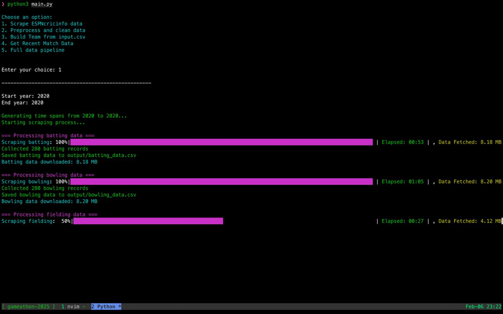

# Cricket Fantasy Team Optimization System



## Overview

This project provides a system for optimizing fantasy cricket team selection using player performance data and roster information. It calculates player form scores based on recent match data and uses these scores to select an optimal team under specific constraints, leveraging a modular design and linear programming techniques.

## Key Features

- **Data Processing:** Cleans and merges batting, bowling, and fielding statistics.
- **Player Form Calculation:** Computes recent performance scores using exponential decay and normalization.
- **Team Optimization:** Builds an optimal fantasy team with role-specific constraints using PuLP.
- **Modular Design:** Organized code structure for scalability and ease of maintenance.

## Usage

### Build Team from Latest Data

To build a fantasy team using the latest player form data, run:

```bash
python3 src/buildteam.py
```

Or, if integrated with a main script:

```bash
python3 main.py --build
```

> **Note:** Ensure the roster data is in the `SquadPlayerNames.csv` file, located as specified in `config.yaml` (typically under a data directory or Downloads folder).

### Update Player Form Data

To update player form scores without building a team, run:

```bash
python3 -m src.playerform
```

This calculates form scores based on recent match data specified in `config.yaml`.

## Project Structure

```
project_root/
├── main.py                     # Main entry point for the application
├── Dockerfile                  # Container configuration for Docker deployment
├── config.yaml                 # Configuration settings and parameters
├── requirements.txt            # Python package dependencies
└── src/                        # Source code directory
    ├── __init__.py             # Makes src a Python package
    ├── geneticalgorithm.py     # Genetic algorithm implementation for team optimization
    ├── lifetimeperformance.py  # Calculates historical player performance metrics
    ├── scrapper.py             # Data scraping utilities for player statistics
    ├── playerform.py           # Player form score calculation
    └── buildteam.py            # Team optimization and selection logic
```

## Getting Started

### Set Up Virtual Environment

1. Create and activate a virtual environment:

   ```bash
   python3 -m venv .venv
   source .venv/bin/activate   # On Windows: .venv\Scripts\activate
   ```

2. Install dependencies:

   ```bash
   pip3 install --no-cache-dir -r requirements.txt
   ```

### Run the Team Builder

```bash
python3 main.py --build
```

Alternatively, you can use Docker:

```bash
docker build -t fantasy-team-builder .
docker run -it --rm fantasy-team-builder
```

## Algorithm

The system consists of two main modules:

### 1. Player Form Calculation (`playerform.py`)

This module processes historical match data to compute performance scores for each player.

#### Process Overview:

- **Data Loading and Cleaning:**
  Inputs include CSV files for batting, bowling, and fielding statistics (paths specified in `config.yaml`).

  - Drops empty columns.
  - Renames non-key columns with prefixes (e.g., `bat_`, `bowl_`, `field_`) except for key columns (`Player`, `Team`, `Start Date`, `End Date`, `Mat`).

- **Merging Data:**
  Merges the batting, bowling, and fielding datasets on key columns using outer joins to create a unified DataFrame.

- **Filtering by Squad and Recency:**

  - **Squad Filtering:** Retains only players listed in the squad CSV (e.g., `SquadPlayerNames.csv`), adding metadata like Credits and Player Type.
  - **Recency:** Filters matches within a specific time window (e.g., last 6 months, configurable via `previous_months` in `config.yaml`).
  - **Indexing:** Sorts by Player and End Date, assigning a match index.

- **Exponential Decay Weighting:**
  Applies weights using `exp(-decay_rate * match_index)` (with `decay_rate` specified in `config.yaml`) to emphasize recent performances.

- **Exponentially Weighted Moving Average (EWMA):**
  Computes the EWMA for each performance metric using the decay weights.

- **Normalization:**
  Normalizes EWMA values to a 0–100 scale using percentile ranking, reflecting relative performance.

- **Composite Scores:**
  Calculates:
  - **Batting Form:** A weighted sum of normalized metrics (e.g., runs: 0.35, average: 0.25, strike rate: 0.2).
  - **Bowling Form:** A weighted sum (e.g., wickets: 0.6, average: 0.2, economy: 0.2) with inverted average and economy (i.e., using `100 - value`).
  - **Fielding Form:** A weighted sum (e.g., catches: 0.5, stumpings: 0.3).

**Example Output:**

```
Player,Batting Form,Bowling Form,Fielding Form,Credits,Player Type,Team
Kane Williamson,85.2,10.5,45.3,9.0,BAT,NZ
Shaheen Afridi,20.1,90.7,30.2,9.0,BOWL,PAK
```

### 2. Fantasy Team Optimizer (`buildteam.py`)

This module selects an optimal 11-player team based on form scores and roster data.

#### Process Overview:

- **Data Loading:**

  - **Evaluation Data:** Loads player form scores, combining recent and overall performance (e.g., 0.6 recent, 0.4 overall).
  - **Roster Data:** Loads `SquadPlayerNames.csv` with columns such as Credits, Player Type, Player Name, Team, and IsPlaying.

- **Filtering and Merging:**

  - Filters the roster to include only "PLAYING" players.
  - Merges the roster data with form scores based on Player and Player Type.
  - Standardizes roles (e.g., converting `ALL` to All Rounder, `BAT` to Batsmen).

- **Score Calculation:**
  Computes role-based scores:

  - **Batsmen:** `batter_weight * Batting Form`
  - **Bowlers:** `bowler_weight * Bowling Form`
  - **All Rounders:**
    A weighted mix of Batting and Bowling Forms, where:
    ```
    batting_ratio = Batting Form / (Batting Form + Bowling Form)
    ```
    then
    ```
    allrounder_score = allrounder_weight * (batting_ratio * Batting Form + (1 - batting_ratio) * Bowling Form)
    ```
  - **Wicket Keepers:** `keeper_weight * Batting Form`

- **Optimization with PuLP:**
  Uses linear programming (via PuLP) to maximize the total team score with the following constraints:
  - Exactly 11 players.
  - Minimum role requirements:
    - ≥ 4 Batsmen.
    - ≥ 5 bowling contributors (Bowlers or All Rounders).
    - ≥ 3 Bowlers.
    - ≥ 1 Wicket Keeper.
    - Exactly 3 All Rounders (selected based on best performance in batting, bowling, and average form).
  - Incorporates leadership designations:
    - **Captain:** 2x multiplier on score.
    - **Vice-Captain:** 1.5x multiplier on score.

**Example Output:**

```
Selected Team

93.66    Batsmen     Daryl Mitchell (Captain)
80.18    Batsmen     Fakhar Zaman (Vice Captain)
85.20    Batsmen     Kane Williamson
76.07    Bowler      Haris Rauf
74.66    Batsmen     Babar Azam
90.70    Bowler      Shaheen Afridi
70.75    All Rounder Glenn Phillips
68.82    Wicket Keeper Mohammad Rizwan
65.30    All Rounder Michael Bracewell
70.61    Bowler      Abrar Ahmed
60.40    All Rounder Agha Salman
```

## Docker Commands

### Prerequisites

Ensure you have the following files in your `~/Downloads` folder:

- `sinister6.csv` (player form data)
- `SquadPlayerNames.csv` (roster data)

### Commands

1. **Load the Model:**

   ```bash
   docker load -i sinister6.tar
   ```

2. **Run the Container:**

   ```bash
   touch ~/Downloads/sinister6.csv
   docker run --rm \
     -v ~/Downloads/SquadPlayerNames.csv:/app/data/SquadPlayerNames.csv \
     -v ~/Downloads/sinister6.csv:/app/sinister6.csv \
     sinister6
   ```

## Input Data Format

**Roster CSV Example (`SquadPlayerNames.csv`):**

```
Credits,Player Type,Player Name,Team,IsPlaying,lineupOrder
7.5,ALL,Michael Bracewell,NZ,PLAYING,7
8.5,BAT,Babar Azam,PAK,PLAYING,2
9,BOWL,Shaheen Afridi,PAK,PLAYING,8
```

## Output File Format

**Team Selection Output Example:**

```
Player,Role,Team,Position
Daryl Mitchell,Batsmen,NZ,Captain
Fakhar Zaman,Batsmen,PAK,Vice Captain
Babar Azam,Batsmen,PAK,Player
```

## Conclusion

- **Player Form Calculation:**
  Cleans, merges, and processes match data to produce normalized form scores using exponential decay.
- **Fantasy Team Optimizer:**
  Combines form scores with roster data, computes role-based scores, and optimizes team selection with PuLP, ensuring balanced team composition and leadership roles.

---

## Explanation of How the Model Works

The Fantasy Team Optimization System operates in two primary stages:

### 1. Player Form Calculation (`playerform.py`)

- **Input Data:**
  CSV files for batting, bowling, and fielding statistics, plus a squad CSV for player metadata.

- **Process:**

  - **Load and Clean:**
    Reads CSV files, drops empty columns, and prefixes columns for clarity.
  - **Merge:**
    Combines datasets on `Player`, `Team`, `Start Date`, `End Date`, and `Mat`.
  - **Filter:**
    Limits data to squad players and recent matches (e.g., last 6 months).
  - **Weighting:**
    Applies an exponential decay (`exp(-decay_rate * match_index)`) to emphasize recent performances.
  - **EWMA:**
    Computes exponentially weighted moving averages for performance metrics.
  - **Normalization:**
    Scales EWMA values to a 0–100 range using percentile ranking.
  - **Composite Scores:**
    Combines metrics into `Batting Form`, `Bowling Form`, and `Fielding Form`.

- **Output:**
  A CSV file with form scores and player metadata (e.g., `Kane Williamson,85.2,10.5,45.3,9.0,BAT,NZ`).

### 2. Fantasy Team Optimizer (`buildteam.py`)

- **Input Data:**
  Form scores CSV and a roster CSV (e.g., `SquadPlayerNames.csv`) with player status.

- **Process:**

  - **Load Data:**
    Merges recent and overall form scores and loads the roster.
  - **Filter and Merge:**
    Retains only "PLAYING" players and standardizes roles.
  - **Score Calculation:**
    Assigns scores based on role:
    - **Batsmen:** Weighted Batting Form.
    - **Bowlers:** Weighted Bowling Form.
    - **All Rounders:** Weighted mix of Batting and Bowling Forms.
    - **Wicket Keepers:** Weighted Batting Form.
  - **Optimization:**
    Uses PuLP to maximize total score with constraints on team composition and leadership designations.

- **Output:**
  An optimized team list with roles and designations (e.g., Captain, Vice Captain).

### Integration

- `playerform.py` generates the form scores.
- `buildteam.py` uses these scores to optimize team selection.
- Configuration (e.g., file paths, weights) is managed via `config.yaml`.

This two-stage process ensures a robust and strategic approach to fantasy team selection, blending historical performance with current form data.

---

Happy team building!
